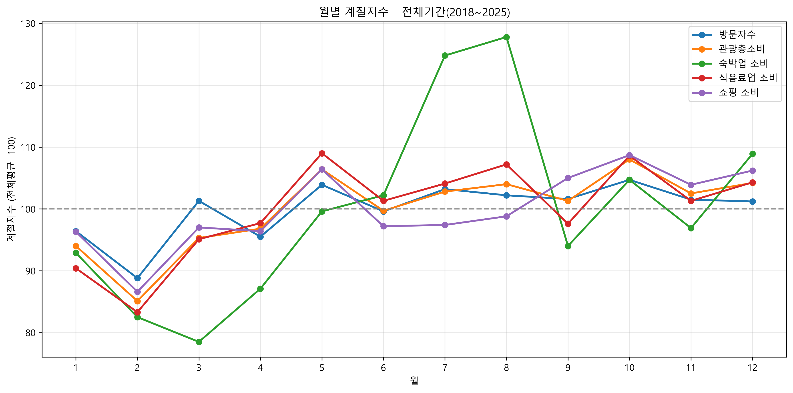

# 전국 관광 월별 변동 패턴 분석 보고서

> **GitHub 저장소**: https://github.com/leemin629/3-1st-mission  
> **데이터 출처**: 한국관광데이터랩 https://datalab.visitkorea.or.kr/  
> **AI 생성 기록**: AI_LOG.md 참고

## 1. 프로젝트 개요

본 프로젝트는 **2018년 1월부터 2025년 12월까지의 전국 관광 관련 월별 데이터**를 활용하여, 관광 수요와 소비의 **월별 변동 패턴**을 분석한 결과를 정리한 보고서이다.

관광산업은 계절적 요인의 영향을 크게 받는 대표적인 분야이다. 특정 시기에는 방문자 수와 소비가 집중되고, 반대로 일부 시기에는 수요가 크게 감소한다. 이러한 월별 변동 패턴을 정량적으로 파악하는 것은 관광정책 수립, 비수기 활성화 전략 마련, 업종별 운영계획 설계에 중요한 기초자료가 된다.

본 분석에서는 전체방문자수와 관광소비 관련 주요 변수를 대상으로 월별 평균과 상대수준 지수를 산출하여, 어느 시기가 성수기이며 어느 시기가 비수기인지를 확인하였다. 또한 코로나19 전후 시기를 구분하여 월별 패턴의 변화 여부를 비교하였다.

추가로 분석 결과를 사용자가 직접 탐색할 수 있도록 **Streamlit 기반 인터랙티브 대시보드**를 구현하여, 정적인 보고서 분석을 상호작용형 결과물로 확장하였다.

---

## 2. 프로젝트 목적

본 프로젝트의 목적은 다음과 같다.

1. 전국 관광의 월별 변동 구조를 정량적으로 파악한다.
2. 방문자수와 관광소비가 어느 시기에 집중되는지 확인한다.
3. 소비 항목별 월별 변동폭 차이를 비교한다.
4. 코로나19 이전, 영향기, 회복기 사이의 패턴 변화를 분석한다.
5. 향후 관광정책 및 산업 운영전략 수립에 활용 가능한 시사점을 도출한다.
6. 분석 결과를 대시보드 형태로 구현하여 사용자 탐색성과 활용성을 높인다.

---

## 3. 데이터 설명

### 3.1 원본 데이터 구성

분석에 활용한 원본 데이터는 `data/raw/` 폴더에 저장된 CSV 파일들이다.  
데이터는 연도별 또는 기간별로 구분되어 있으며, 각 기간마다 관광 관련 세부 파일들이 포함되어 있다.

원자료는 다음과 같은 기간으로 구성된다.

- 201801-201812
- 201901-201912
- 202001-202012
- 202101-202112
- 202201-202212
- 202301-202312
- 202401-202412
- 202501-202512

각 기간에는 다음과 같은 유형의 자료가 포함되어 있다.

- 관광소비 추이
- 방문자 수 추이
- 업종별 지출액
- 지역별 방문자 수(광역)
- 지역별 방문자 수(기초지자체)
- 지역별 지출액

즉, 전체적으로 **8개 기간 × 기간별 6개 파일 = 총 48개 CSV 파일**을 기반으로 분석을 수행하였다.

### 3.2 전처리 데이터

원본 데이터를 정리하고 분석 가능한 형태로 통합한 뒤 다음과 같은 전처리 파일을 생성하였다.

- `data/processed/01_trend_monthly.csv`
- `data/processed/02_regional_wide.csv`
- `data/processed/03_regional_basic.csv`
- `data/processed/monthly_tourism_variables.csv`

이 중 본 보고서의 핵심 분석 파일은 다음과 같다.

- `data/processed/monthly_tourism_variables.csv`

### 3.3 분석 변수

본 분석에서 사용한 주요 변수는 다음과 같다.

- 전체방문자수
- 관광총소비
- 숙박업소비
- 식음료업소비
- 쇼핑소비

원자료에서는 일부 소비 변수가 `_천원` 단위로 표기되어 있으며, 본 보고서에서는 서술의 간결성을 위해 변수명을 축약하여 사용하였다.

각 변수는 관광 수요와 소비 구조를 대표하는 핵심 지표로 설정하였다.

### 3.4 분석 기간 구분

코로나19 전후의 구조적 차이를 확인하기 위하여 전체 기간을 다음과 같이 구분하였다.

| 구분 | 기간 | 개월 수 |
|---|---|---:|
| 전체 기간 | 2018.01 ~ 2025.12 | 96 |
| 코로나 이전 | 2018.01 ~ 2019.12 | 24 |
| 코로나 영향기 | 2020.01 ~ 2021.12 | 24 |
| 회복기 | 2022.01 ~ 2025.12 | 48 |

---

## 4. 분석 방법

### 4.1 데이터 정제 및 통합

원본 CSV 파일들에서 필요한 열을 추출하고, 시계열 기준으로 정렬한 뒤 월 단위 비교가 가능하도록 데이터 구조를 통일하였다. 또한 분석에 직접 사용하지 않는 변수는 제외하고, 핵심 관광 지표 중심으로 분석용 데이터셋을 구성하였다.

### 4.2 월별 평균 계산

각 변수에 대해 같은 월끼리 묶어서 평균을 계산하였다.  
예를 들어 1월 평균은 전체 기간 내 모든 1월 값의 평균이며, 같은 방식으로 2월부터 12월까지 월별 평균을 산출하였다.

이를 통해 장기적으로 특정 월이 다른 월에 비해 상대적으로 높은지 낮은지를 확인할 수 있도록 하였다.

### 4.3 월별 상대수준 지수 계산

단순 월평균만으로는 각 월이 전체 평균 대비 얼마나 높은 수준인지 직관적으로 파악하기 어렵기 때문에 다음 지표를 계산하였다.

**월별 상대수준 지수 = (해당 월 평균 / 해당 기간 전체 월평균) × 100**

이 지수는 다음과 같이 해석할 수 있다.

- **100 초과**: 해당 월이 기간 평균보다 높음
- **100 미만**: 해당 월이 기간 평균보다 낮음
- **값이 클수록** 성수기 성격이 강함
- **값이 작을수록** 비수기 성격이 강함

### 4.4 비교 분석 방식

분석은 크게 두 단계로 진행하였다.

1. **전체 기간(2018~2025)** 기준의 월별 변동 패턴 분석
2. **코로나 이전 / 영향기 / 회복기** 구간별 패턴 비교

이를 통해 장기 평균 기준의 월별 변동 구조와 외부 충격 이후의 구조 변화를 함께 살펴보았다.

### 4.5 분석 및 결과 구현 절차

전체 프로젝트 절차는 다음과 같다.

1. 원본 데이터 수집 및 구조 확인
2. 기간별 CSV 파일 정리
3. 필요한 변수 추출 및 컬럼 표준화
4. 전처리 데이터셋 생성
5. 분석 변수 선정
6. 월별 평균 계산
7. 월별 상대수준 지수 산출
8. 전체 기간 기준 패턴 분석
9. 코로나19 전후 구간 비교 분석
10. 결과 시각화 정리
11. Streamlit 대시보드 설계 및 구현
12. README 및 REPORT 문서 정리

---

## 5. 전체 기간 기준 주요 결과

전체 기간을 기준으로 분석한 결과, 전국 관광은 뚜렷한 **월별 변동 패턴**을 보였다.  
특히 **10월은 방문자수와 관광총소비, 쇼핑소비에서 공통적으로 높은 수준**을 보였으며, **2월은 대부분의 변수에서 낮은 수준**을 나타내어 대표적인 비수기 가능성이 확인되었다.

또한 방문자수보다 소비 변수에서 월별 변동폭이 더 크게 나타났다. 이는 단순히 관광객이 많이 오는 시기와 실제 지출이 크게 늘어나는 시기가 완전히 동일하지 않을 수 있으며, 관광 수요의 양적 확대보다 소비 강도의 변화가 더 크게 작용하는 시기가 존재함을 시사한다.

### 5.1 전체 기간 월별 상대수준 지수 시각화



전체 기간 기준 월별 상대수준 지수를 보면, 10월은 주요 변수에서 상대적으로 높은 수준을 보이고 2월은 낮은 수준을 나타내어 전국 관광의 월별 변동 패턴이 비교적 뚜렷하게 확인된다.

---

## 6. 변수별 분석 결과

전체 기간 기준으로 각 변수의 대표적인 최고월과 최저월을 정리하면 다음과 같다.

| 변수 | 최고월 | 최저월 | 해석 |
|---|---|---|---|
| 전체방문자수 | 10월 | 2월 | 가을철 방문 집중 현상이 비교적 뚜렷함 |
| 관광총소비 | 10월 | 2월 | 방문 규모보다 소비 강도 변화가 더 큼 |
| 숙박업소비 | 8월 | 3월 | 여름 휴가철 집중 경향이 강함 |
| 식음료업소비 | 5월 | 2월 | 봄철과 가을철의 다중 성수기 경향 |
| 쇼핑소비 | 10월 | 2월 | 가을철 관광과 연계된 소비 증가 가능성 |

### 6.1 전체방문자수

전체방문자수는 전반적으로 큰 폭의 급등락보다는 비교적 완만한 변동을 보였지만, 그중에서도 **10월이 가장 높은 수준**을 기록하였다. 이는 가을철 이동 수요와 지역 축제, 단풍 관광, 연휴 효과 등이 복합적으로 반영된 결과로 해석할 수 있다.

반면 **2월은 가장 낮은 수준**을 나타내었다. 겨울 후반부는 비수기 특성이 겹치며 전국 단위 관광 수요가 상대적으로 위축되는 경향이 있는 것으로 볼 수 있다.

### 6.2 관광총소비

관광총소비는 방문자수보다 더 큰 월별 변동폭을 보였다.  
특히 **10월 소비 수준이 가장 높게 나타났으며**, 이는 단순 유입 증가뿐 아니라 실제 지출 규모 역시 가을철에 집중되는 경향이 있음을 의미한다.

또한 **2월은 관광총소비의 저점 구간**으로 나타났다. 이는 관광객 수 감소와 함께 소비 활동 자체도 함께 위축되는 구조가 존재할 가능성을 보여준다.

### 6.3 숙박업소비

숙박업소비는 전체 변수 중 **가장 큰 월별 집중도**를 보였다.  
특히 **8월이 최고 수준**을 기록하였으며, 이는 여름 휴가철 숙박 수요가 집중된 결과로 해석할 수 있다.

반면 **3월은 낮은 수준**을 보여 숙박업은 특정 성수기 의존도가 높은 업종임을 알 수 있다. 다른 소비 항목보다 성수기와 비수기의 격차가 크므로, 업종별 대응 전략이 특히 중요하다고 볼 수 있다.

### 6.4 식음료업소비

식음료업소비는 특정 한 달에만 집중되기보다는, **5월을 포함한 봄철과 가을철에 비교적 강세를 보이는 다중 성수기 구조**를 나타냈다.

이는 식음료 소비가 숙박처럼 장기 체류 수요에만 의존하지 않고, 당일치기 방문이나 단기 이동 수요에도 민감하게 반응할 수 있음을 시사한다.  
최저월은 **2월**로 나타났으며, 전체적인 관광 유입 감소의 영향을 함께 받는 것으로 볼 수 있다.

### 6.5 쇼핑소비

쇼핑소비는 **10월이 최고 수준**, **2월이 최저 수준**으로 나타났다.  
이는 가을철 관광활동과 함께 지역 특산품 구매, 기념품 소비, 축제 연계 소비 등이 증가할 가능성을 보여준다.

쇼핑소비는 방문자수와 유사한 흐름을 일부 보이지만, 소비 확대 정도는 더 크게 나타날 수 있어 단순 이동보다 소비행위의 집중도가 더 중요할 수 있음을 시사한다.

---

## 7. 코로나19 전후 비교 결과

코로나19는 관광산업 전반에 큰 충격을 주었으나, 월별 계절 구조 자체가 완전히 사라지지는 않았다. 오히려 시기별로 성수기 강도와 집중 시점이 달라지는 양상이 나타났다.

### 7.1 코로나 이전(2018~2019)

코로나 이전 시기에는 전통적인 관광 성수기와 비수기 구조가 비교적 안정적으로 나타났다.  
가을철과 여름철 일부 구간에서 높은 수준이 확인되었고, 겨울 후반과 초봄에는 낮은 수준이 나타나는 전형적인 월별 변동 패턴이 확인되었다.

### 7.2 코로나 영향기(2020~2021)

코로나 영향기에는 전체적인 이동 제한과 외부 활동 위축의 영향으로 월별 변동 패턴이 일부 흔들리는 모습을 보였다.  
다만 완전히 무작위적인 구조가 나타난 것은 아니며, 특정 시기에 수요가 다시 집중되는 경향도 일부 관찰되었다.

특히 방문자수보다 소비 지표에서 월별 변동폭이나 특정 월 집중 현상이 더 크게 나타나는 경우가 있어, 관광활동이 재개되는 시점에서 소비 반응이 상대적으로 강하게 나타날 수 있음을 보여주었다.

### 7.3 회복기(2022~2025)

회복기에는 다시 일정한 월별 구조가 뚜렷해지는 양상이 나타났다.  
방문자수와 주요 소비지표에서 **10월 강세**가 반복적으로 확인되었고, **2월 저점 구조** 역시 상당 부분 유지되었다.

이는 코로나19 이후 관광시장이 회복되는 과정에서도 기존의 월별 변동 패턴이 다시 작동하고 있음을 의미한다. 다만 업종별로 회복 속도와 집중 시점은 다를 수 있으므로 세부 업종 단위의 해석이 필요하다.

### 7.4 시기별 비교 시사점

시기별 분석 결과를 종합하면 다음과 같은 해석이 가능하다.

1. 관광의 월별 변동 패턴은 외부 충격에도 완전히 사라지지 않았다.
2. 방문자수보다 소비 변수에서 계절성이 더 강하게 나타날 수 있다.
3. 회복기에는 기존 성수기 구조가 다시 강화되는 경향이 확인되었다.
4. 업종별로 성수기 시점이 다르므로 일괄적 대응보다 맞춤형 전략이 필요하다.

---
## 8. 분석 질문별 답변

본 프로젝트에서는 전국 관광 월별 변동 패턴을 이해하기 위해 다음 4개의 분석 질문을 설정하였다.

1. 전국 관광 방문자 수는 월별로 어떤 계절성을 보이는가?
2. 관광 소비는 방문자 수와 같은 시기에 증가하는가?
3. 코로나19 이전·영향기·회복기 사이에 월별 패턴은 어떻게 달라졌는가?
4. 소비 항목별로 성수기와 비수기의 차이는 얼마나 다른가?

아래에서는 각 질문에 대해 **관찰(그래프 및 표에서 직접 확인한 사실)** 과 **해석(그 의미와 시사점)** 을 구분하여 정리하였다.

### 8.1 질문 1. 전국 관광 방문자 수는 월별로 어떤 계절성을 보이는가?

#### 관찰
- 전체 기간(2018~2025) 기준으로 **전체방문자수는 10월이 최고월, 2월이 최저월**로 나타났다.
- 월별 추이 그래프에서는 **5월과 10월 전후에 상대적으로 높은 수준**이 반복적으로 나타났다.
- 특히 10월은 여러 연도에서 공통적으로 높은 수준을 보여, 일시적 현상이라기보다 반복적 계절 패턴에 가깝다고 볼 수 있다.

#### 해석
- 전국 관광은 연중 고르게 분포하기보다 **봄과 가을에 수요가 집중되는 구조**를 가진다.
- 그중에서도 **10월은 대표 성수기**, **2월은 대표 비수기**로 해석할 수 있다.
- 이는 기후 조건, 연휴, 야외활동 적합성, 지역 축제 및 단풍 관광 수요 등이 복합적으로 작용한 결과일 가능성이 크다.

#### 관련 대시보드 화면
- **전국 월별 변화 탭**
- 사용 시나리오: 연도를 여러 개 선택한 뒤 `전체방문자수`를 선택하면 연도별 계절성 반복 여부를 비교할 수 있다.

---

### 8.2 질문 2. 관광 소비는 방문자 수와 같은 시기에 증가하는가?

#### 관찰
- **관광총소비 역시 10월이 최고월, 2월이 최저월**로 나타나 전체방문자수와 유사한 흐름을 보였다.
- `README.md` 및 대시보드 분석 결과에서도 **방문자 수 정점 시기와 소비 정점 시기(5월·10월)가 대체로 겹치는 경향**이 확인되었다.
- 다만 소비 항목별로 보면 차이가 존재한다.
  - **숙박업소비: 8월 최고**
  - **식음료업소비: 5월 최고**
  - **쇼핑소비: 10월 최고**

#### 해석
- 전체적인 수준에서는 **방문자 증가와 소비 증가가 같은 방향으로 움직이는 경향**이 있다.
- 즉, 관광객 유입이 늘어나는 시기에 소비도 함께 확대되는 구조를 확인할 수 있다.
- 그러나 세부 업종으로 내려가면 성수기 시점이 다르므로, **“방문자 증가 = 모든 업종 소비 동시 증가”** 로 단순화해서 해석하면 한계가 있다.
- 따라서 총소비와 방문자 수는 함께 보되, 업종별 소비는 별도로 해석하는 접근이 필요하다.

#### 관련 대시보드 화면
- **전국 월별 변화 탭**
- **전국 관광 소비 분석 탭**
- 사용 시나리오: `전체방문자수`와 `관광총소비`를 비교한 뒤, 소비 탭에서 숙박·식음료·쇼핑 항목을 따로 선택하여 정점 시점 차이를 확인할 수 있다.

---

### 8.3 질문 3. 코로나19 이전·영향기·회복기 사이에 월별 패턴은 어떻게 달라졌는가?

#### 관찰
- 코로나 이전(2018~2019)에는 성수기와 비수기 구조가 비교적 안정적으로 나타났다.
- 코로나 영향기(2020~2021)에는 월별 패턴이 일부 흔들리며, 기존의 계절성이 약해진 구간이 관찰되었다.
- 그러나 회복기(2022~2025)에는 다시 **10월 강세와 2월 약세 구조**가 반복적으로 확인되었다.
- 즉, 외부 충격으로 수준 자체는 크게 흔들렸지만, 장기적으로 보면 계절 구조는 다시 나타나는 경향을 보였다.

#### 해석
- 코로나19는 관광 규모와 흐름에 큰 충격을 주었지만, **관광의 계절성 자체를 완전히 없애지는 못했다**고 볼 수 있다.
- 회복기에는 기존의 성수기·비수기 구조가 다시 강화되면서 관광시장의 기본적인 계절 패턴이 재작동한 것으로 해석된다.
- 이는 향후 유사한 외부 충격이 발생하더라도, 회복 국면에서는 다시 계절적 수요 집중이 나타날 가능성이 높다는 점을 시사한다.

#### 관련 대시보드 화면
- **전국 월별 변화 탭**
- 사용 시나리오: 2018~2019년만 선택해 코로나 이전 패턴을 보고, 2020~2021년을 선택해 영향기를 비교한 뒤, 2022~2025년을 선택해 회복기의 재강화 여부를 확인할 수 있다.

---

### 8.4 질문 4. 소비 항목별로 성수기와 비수기의 차이는 얼마나 다른가?

#### 관찰
- 소비 항목별 최고월과 최저월은 다음과 같이 다르게 나타났다.

| 변수 | 최고월 | 최저월 | 특징 |
|---|---|---|---|
| 관광총소비 | 10월 | 2월 | 전체 방문 흐름과 유사 |
| 숙박업소비 | 8월 | 3월 | 여름 휴가철 집중도가 가장 큼 |
| 식음료업소비 | 5월 | 2월 | 봄·가을의 다중 성수기 경향 |
| 쇼핑소비 | 10월 | 2월 | 가을철 관광 수요와 연동 |

- 특히 **숙박업소비는 전체 변수 중 가장 큰 월별 집중도**를 보였다.
- 반면 **식음료업소비는 특정 한 달에만 집중되기보다 분산된 성수기 구조**를 나타냈다.

#### 해석
- 소비 항목은 모두 같은 방식으로 움직이지 않으며, **업종별로 서로 다른 계절 구조**를 가진다.
- 숙박업은 여름 성수기 대응이 핵심이고, 식음료업은 봄·가을 단기 유동수요 대응이 중요하며, 쇼핑소비는 가을철 관광활동과의 연계성이 크다고 볼 수 있다.
- 따라서 관광정책이나 업종 운영 전략은 전체 평균만 볼 것이 아니라, **업종별 성수기·비수기 차이를 반영한 맞춤형 접근**이 필요하다.

#### 관련 대시보드 화면
- **전국 관광 소비 분석 탭**
- 사용 시나리오: 숙박업소비, 식음료업소비, 쇼핑소비를 각각 선택해 월별 정점 시점과 변동폭 차이를 비교할 수 있다.

---

### 8.5 분석 질문 종합 정리

4개의 질문에 대한 답변을 종합하면 다음과 같다.

1. 전국 관광 방문자 수는 **10월 강세, 2월 약세**를 중심으로 한 뚜렷한 계절성을 보였다.
2. 관광 소비는 전반적으로 방문자 수와 함께 증가했지만, **업종별 정점 시점은 서로 달랐다.**
3. 코로나19는 관광 흐름을 크게 흔들었지만, **회복기에는 기존 계절성이 다시 강화**되었다.
4. 숙박·식음료·쇼핑 소비는 서로 다른 성수기 구조를 가지므로, **업종별 맞춤형 해석과 전략 수립이 필요하다.**

이러한 결과는 이후의 대시보드 구현과 활용 시나리오에서도 그대로 반영되며, 사용자는 대시보드에서 연도·변수·지역을 직접 선택하여 위 질문들에 대한 답을 상호작용적으로 확인할 수 있다.

## 9. Streamlit 대시보드 구현

정적인 그래프와 표만으로는 사용자가 원하는 연도와 변수 조합을 직접 비교하는 데 한계가 있으므로,  
분석 결과를 보다 직관적으로 탐색할 수 있도록 **Streamlit 기반 인터랙티브 대시보드**를 구현하였다.

### 9.1 구현 목적

대시보드 구현 목적은 다음과 같다.

1. 사용자가 특정 연도를 선택하여 월별 변동 패턴을 확인할 수 있도록 한다.
2. 여러 연도를 동시에 선택하여 같은 변수의 연도별 차이를 비교할 수 있도록 한다.
3. 방문자 수와 소비 변수들을 자유롭게 선택하여 비교할 수 있도록 한다.
4. 정적 분석 결과를 상호작용형 결과물로 확장하여 활용성을 높인다.

### 9.2 주요 기능

구현한 주요 기능은 다음과 같다.

- 연도 다중 선택
- 변수 다중 선택
- `pills` 기반 직관적 선택 UI
- 전체 선택 / 전체 해제 토글 기능
- 선택값이 없을 때 빈 화면 유지
- Plotly 기반 인터랙티브 선 그래프
- 마우스 오버 시 월 / 연도 / 값 표시
- 선택한 변수별 시각화 자동 반영

### 9.3 대시보드 실행 화면 예시


대시보드는 사용자가 연도와 변수를 선택하면 해당 조건에 맞는 월별 추이를 즉시 시각화하도록 구성하였다.

### 9.4 구현 세부 설명

#### (1) 연도 선택 기능

연도는 다중 선택이 가능하도록 구성하였다.  
사용자는 2018년부터 2025년까지 원하는 연도를 하나 이상 선택할 수 있으며, 선택한 연도에 해당하는 데이터만 그래프에 표시된다.

이를 통해 다음과 같은 비교가 가능하다.

- 단일 연도의 월별 패턴 확인
- 여러 연도의 동일 월 비교
- 코로나 이전과 회복기의 패턴 차이 비교

#### (2) 변수 선택 기능

변수 역시 다중 선택이 가능하도록 구성하였다.  
사용자는 다음 변수 중 원하는 항목을 선택하여 동시에 비교할 수 있다.

- 전체방문자수
- 관광총소비_천원
- 숙박업소비_천원
- 식음료업소비_천원
- 쇼핑소비_천원

다만 변수마다 단위와 값의 규모가 다를 수 있으므로, 해석 시 절대값보다 월별 흐름과 상대적 변동 패턴에 주목할 필요가 있다.

#### (3) pills UI 적용

기존의 일반 체크박스나 멀티셀렉트 방식보다 더 직관적인 사용 경험을 제공하기 위해 `pills` 형태의 선택 UI를 적용하였다.

이 방식의 장점은 다음과 같다.

- 선택된 항목이 시각적으로 더 분명하게 드러남
- 버튼 형태로 빠르게 클릭 가능
- 대시보드 화면이 더 간결하고 현대적으로 보임

#### (4) 전체 선택 / 전체 해제 토글

사용 편의성을 높이기 위해 연도 선택 영역에 **전체 선택 / 전체 해제 토글 기능**을 추가하였다.

이 기능을 통해 사용자는 다음과 같이 빠르게 조작할 수 있다.

- 모든 연도를 한 번에 선택
- 모든 연도를 한 번에 해제
- 초기화 후 원하는 연도만 다시 선택

특히 비교 분석 시 여러 연도를 반복적으로 선택해야 하는 번거로움을 줄여 준다는 점에서 활용성이 높다.

#### (5) 초기값 비우기

대시보드 첫 화면에서 연도나 변수가 자동 선택되어 있으면 사용자가 의도하지 않은 그래프가 먼저 출력될 수 있다.  
이를 방지하기 위해 초기 상태에서는 선택값을 비워 두고, 사용자가 직접 선택했을 때만 결과가 나타나도록 구성하였다.

이 설계는 다음과 같은 장점이 있다.

- 사용자의 탐색 의도를 더 잘 반영함
- 화면이 과하게 복잡해지는 것을 방지함
- 어떤 데이터를 보고 있는지 더 명확하게 인식할 수 있음

#### (6) Plotly Hover 기능

그래프는 Plotly를 사용하여 구현하였으며, 마우스를 선 위에 올리면 해당 지점의 정보가 표시되도록 하였다.

Hover 정보에는 다음 항목이 포함된다.

- 월
- 연도
- 값

이 기능을 통해 사용자는 그래프의 대략적인 흐름뿐 아니라 실제 수치 수준도 손쉽게 확인할 수 있다.

### 9.5 대시보드 구현 코드 구조

대시보드와 관련된 주요 파일 구조는 다음과 같다.

```bash
app.py
dashboard/
├── __init__.py
├── dashboard_app.py
```

- `app.py`: Streamlit 실행 진입점
- `dashboard/dashboard_app.py`: 대시보드 레이아웃 및 시각화 구현

### 9.6 대시보드 구현 의의

본 프로젝트는 단순한 데이터 분석 보고서 작성에 그치지 않고, 분석 결과를 **사용자가 직접 조작하고 탐색할 수 있는 서비스 형태**로 확장했다는 점에서 의미가 있다.

특히 다음과 같은 교육적, 실무적 의의를 가진다.

1. 데이터 전처리 → 분석 → 시각화 → 대시보드 구현까지 전체 흐름을 경험하였다.
2. 정적 보고서와 동적 대시보드를 함께 구성하여 결과 전달력을 높였다.
3. 사용자의 선택에 따라 다양한 비교가 가능하도록 하여 실용성을 강화하였다.

---

## 10. 프로젝트 구조 및 산출물

최종 프로젝트의 주요 폴더 구조는 다음과 같다.

```bash
tourism-analysis-project/
├── app.py
├── README.md
├── REPORT.md
├── requirements.txt
├── data/
│   ├── raw/
│   └── processed/
├── dashboard/
│   ├── __init__.py
│   └── dashboard_app.py
├── notebooks/
├── output/
│   ├── seasonality/
│   └── dashboard/
└── src/
```

### 10.1 주요 산출물 설명

#### (1) 데이터 파일

- `data/raw/`: 원본 CSV 데이터 저장
- `data/processed/`: 전처리 완료 데이터 저장

#### (2) 분석 결과물

- 월별 평균 및 상대수준 지수
- 변수별 계절성 비교 결과
- 코로나19 전후 시기 비교 결과
- 시각화 이미지 파일

#### (3) 서비스 결과물

- Streamlit 대시보드
- 대화형 월별 관광 패턴 탐색 기능

#### (4) 문서 결과물

- `README.md`: 프로젝트 소개 및 실행 방법
- `REPORT.md`: 분석 배경, 방법, 결과, 해석, 결론 정리

### 10.2 실행 환경

프로젝트는 Python 기반으로 구성하였으며, 주요 활용 라이브러리는 다음과 같다.

- pandas
- numpy
- matplotlib
- seaborn
- plotly
- streamlit

필요 패키지는 `requirements.txt`에 정리하였다.

### 10.3 실행 방법

프로젝트 실행 예시는 다음과 같다.

```bash
pip install -r requirements.txt
streamlit run app.py
```

위 명령어를 실행하면 브라우저에서 대시보드를 열어 결과를 확인할 수 있다.

---

## 11. 해석 및 시사점

본 분석 결과는 전국 관광의 월별 변동 구조가 비교적 뚜렷하며, 특히 **가을철 강세와 겨울 후반 약세**가 반복적으로 나타난다는 점을 보여준다. 또한 방문자 수와 소비는 유사한 흐름을 보이면서도, 소비 변수에서 계절적 집중 현상이 더 크게 나타날 수 있음을 확인하였다.

이를 바탕으로 다음과 같은 시사점을 도출할 수 있다.

### 11.1 성수기 대응 전략의 정교화 필요

10월과 8월 등 특정 시기에 수요와 소비가 집중되는 경향이 확인되므로, 해당 시기에는 지역별 수용능력 관리와 혼잡 완화 전략이 중요하다.

예를 들면 다음과 같은 대응이 가능하다.

- 성수기 교통 및 주차 관리 강화
- 인기 관광지 분산 유도
- 숙박 및 식음료 공급 대응 강화
- 안전관리와 현장 운영 인력 확대

즉, 성수기에는 단순 홍보 확대보다 **효율적 수용과 운영 최적화**가 더 중요할 수 있다.

### 11.2 비수기 활성화 정책 필요

2월과 3월 일부 구간처럼 상대적으로 낮은 수준을 보이는 시기에는 비수기 활성화 전략이 필요하다.

가능한 정책 방향은 다음과 같다.

- 겨울·초봄 특화 관광상품 개발
- 지역 축제 및 실내형 콘텐츠 확대
- 숙박·식음료 연계 할인 프로그램 운영
- 단기 체류형 이벤트 기획

이는 관광 수요의 연중 분산을 유도하고 지역 관광산업의 계절 편중 문제를 완화하는 데 도움이 될 수 있다.

### 11.3 업종별 맞춤형 전략 필요

분석 결과, 숙박업소비는 8월 집중도가 매우 높았고 식음료업소비는 다중 성수기 구조를 보였다.  
이는 업종별로 성수기 시점과 변동폭이 다르다는 의미이며, 모든 업종에 동일한 전략을 적용하는 것은 한계가 있음을 보여준다.

따라서 다음과 같은 업종별 접근이 필요하다.

- 숙박업: 극성수기 수요 대응, 비수기 프로모션 강화
- 식음료업: 단기 유동인구 대응형 전략 강화
- 쇼핑업: 축제·관광지 연계 상품 기획 확대

### 11.4 회복기 관광정책 설계에 대한 시사점

코로나19 이후 회복기에도 기존의 월별 변동 패턴이 다시 강화되는 양상이 나타났다는 점은, 관광산업이 외부 충격 이후에도 일정 수준의 구조적 계절성을 회복한다는 것을 시사한다.

이는 향후 유사한 위기 상황이 발생하더라도 다음과 같은 방식의 정책 설계가 가능함을 의미한다.

- 회복 초기에는 이동량보다 소비 회복 여부를 함께 점검
- 업종별 회복 속도 차이를 고려한 지원정책 설계
- 장기적으로는 기존 성수기·비수기 구조를 반영한 운영전략 유지

---

## 12. 한계점 및 개선 방향

본 프로젝트는 월별 변동 패턴을 파악하는 데 초점을 맞추었지만, 다음과 같은 한계가 존재한다.

### 12.1 데이터 범위의 한계

본 분석은 제공된 CSV 자료를 기반으로 수행되었으며, 데이터 정의나 수집 방식의 세부 차이를 모두 반영하지는 못하였다.  
또한 전국 단위 중심 분석이므로 지역별 특수성은 충분히 드러나지 않을 수 있다.

### 12.2 외부 변수 미반영

기상조건, 공휴일 수, 연휴 길이, 지역 축제 일정, 물가 수준, 교통 여건 등의 외부 요인은 관광 변동에 중요한 영향을 줄 수 있다.  
그러나 본 분석에서는 주로 월별 관측값 자체의 패턴에 집중하였기 때문에 이러한 설명 변수는 별도로 반영하지 않았다.

### 12.3 인과관계 분석의 한계

본 프로젝트는 탐색적 데이터 분석 성격이 강하므로, 특정 월에 관광이 증가하거나 감소한 원인을 인과적으로 검증한 것은 아니다.  
따라서 결과 해석은 패턴 확인과 정책적 시사점 제시에 중점을 두었다.

### 12.4 개선 방향

향후 다음과 같은 방향으로 확장할 수 있다.

1. 지역별 세부 분석 추가
2. 업종별 세분화 분석 확대
3. 공휴일 및 날씨 변수 결합
4. 예측 모델링 추가
5. 지도 시각화 및 지역 비교 기능 추가
6. 대시보드 필터 기능 고도화

특히 지역별 분석과 예측 기능이 추가된다면 정책 및 산업 실무에서 활용성이 더욱 높아질 것이다.

---

## 13. 결론

본 프로젝트는 2018년부터 2025년까지의 전국 관광 관련 월별 데이터를 활용하여 관광 수요와 소비의 월별 변동 패턴을 분석하고, 그 결과를 시각화 및 대시보드 형태로 구현한 프로젝트이다.

분석 결과, 전국 관광은 뚜렷한 계절성을 보였으며 다음과 같은 특징이 확인되었다.

1. **10월은 전체방문자수, 관광총소비, 쇼핑소비에서 공통적으로 높은 수준**을 보였다.
2. **2월은 다수 변수에서 낮은 수준**을 보여 대표적인 비수기 특성이 확인되었다.
3. **숙박업소비는 8월 집중도가 매우 높아 업종별 계절성이 특히 강함**을 확인하였다.
4. **식음료업소비는 다중 성수기 구조**를 보이며 비교적 분산된 패턴을 나타냈다.
5. 코로나19 영향에도 불구하고 관광의 월별 변동 구조는 완전히 사라지지 않았으며, 회복기에는 다시 뚜렷해지는 경향이 나타났다.

또한 본 프로젝트는 분석에 그치지 않고 Streamlit 기반 대시보드를 구현함으로써, 사용자가 직접 연도와 변수를 선택하여 결과를 탐색할 수 있도록 확장하였다. 이는 데이터 분석 결과의 전달력과 실용성을 높였다는 점에서 의미가 있다.

종합하면, 본 프로젝트는 전국 관광의 월별 변동 구조를 이해하고, 성수기·비수기 대응 전략 및 업종별 운영 방향을 고민하는 데 활용 가능한 기초 자료를 제공한다.  
향후 지역별·업종별 심화 분석과 예측 기능이 추가된다면 더욱 실질적인 관광정책 및 산업 의사결정 지원 도구로 발전할 수 있을 것이다.

---

## 14. 참고 파일

본 프로젝트에서 함께 활용한 주요 파일은 다음과 같다.

- `README.md`
- `REPORT.md`
- `app.py`
- `dashboard/dashboard_app.py`
- `data/processed/monthly_tourism_variables.csv`
- `output/seasonality/seasonal_index_overall_2018_2025.png`

---

## 15. 실행 화면

### 소개


### 전국 월별 변화


### 전국 관광 소비 분석


### 지역별 방문 변화


### 지역별 방문자 수 추이


### 전국 관광 소비


## 16. 부록

### 16.1 핵심 분석 변수 요약

| 변수명 | 의미 |
|---|---|
| 전체방문자수 | 전국 관광 방문자 수 |
| 관광총소비_천원 | 전체 관광 관련 소비 금액 |
| 숙박업소비_천원 | 숙박 관련 소비 금액 |
| 식음료업소비_천원 | 식음료 관련 소비 금액 |
| 쇼핑소비_천원 | 쇼핑 관련 소비 금액 |

### 16.2 분석 핵심 요약

| 항목 | 주요 내용 |
|---|---|
| 대표 성수기 | 10월 |
| 대표 비수기 | 2월 |
| 숙박업 최고 집중 시기 | 8월 |
| 소비 계절성 특징 | 방문자수보다 더 크게 나타남 |
| 코로나 이후 변화 | 회복기에 기존 패턴 재강화 |

이상으로 전국 관광 월별 변동 패턴 분석 프로젝트 보고서를 마친다.

## 참고
- GitHub 저장소: https://github.com/leemin629/3-1st-mission
- 데이터 출처: 한국관광데이터랩
- 원문 URL: https://datalab.visitkorea.or.kr/
- AI 활용 기록: AI_LOG.md