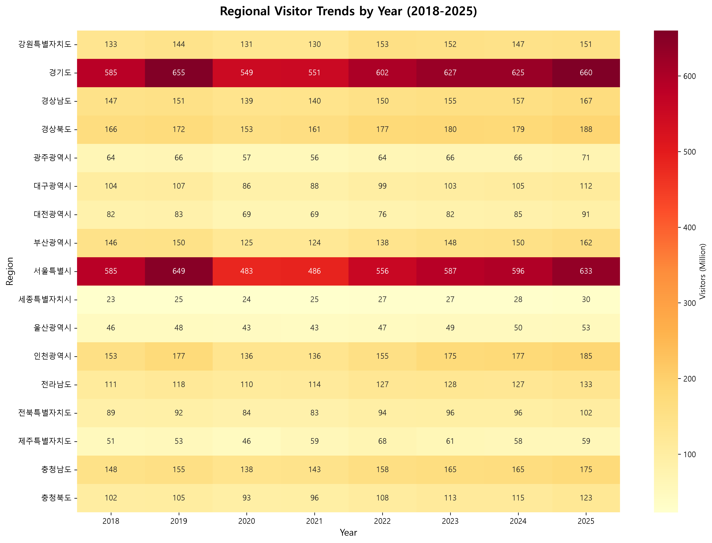
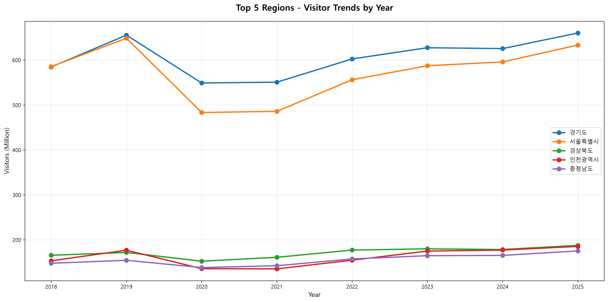
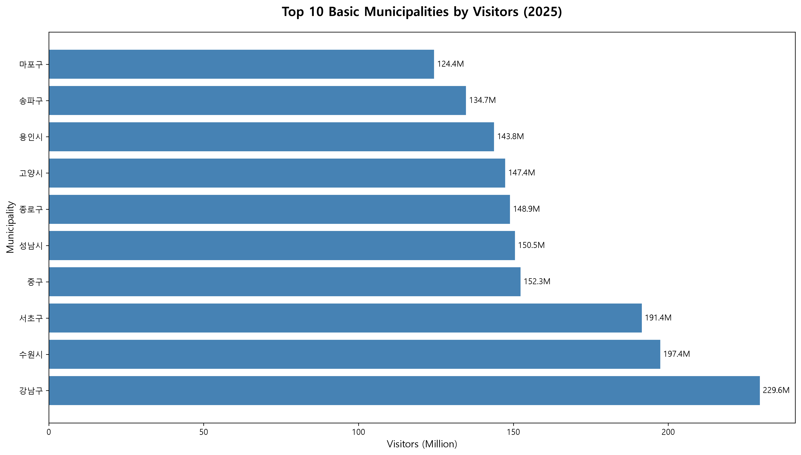
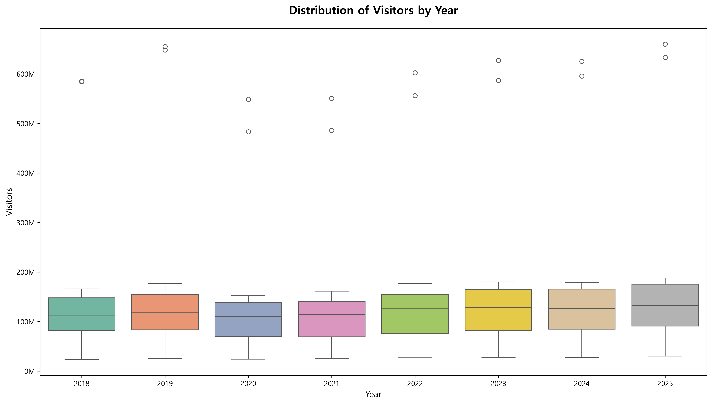

# 📊 국내여행 17개 시도 방문자 선호도 분석 리포트

## 1. 개요
- **분석 주제**: 전국 17개 광역시도 및 기초지자체 방문자 선호도 시계열 분석
- **분석 기간**: 2018년 ~ 2025년 (8개 연도)
- **데이터 규모**: 광역 136행 / 기초 1832행
- **결측치**: 0개 (정제 완료)

---

## 2. 데이터 구조
| 파일 | 행 수 | 설명 |
|------|-------|------|
| 01_trend_monthly.csv | 288 | 월별 전국 방문자 추이 |
| 02_regional_wide.csv | 136 | 광역지자체별 연도별 방문자 |
| 03_regional_basic.csv | 1832 | 기초지자체별 연도별 방문자 |

---

## 3. 주요 분석 결과

### 3-1. 2025년 광역지자체 TOP 3
| 순위 | 지역 | 방문자 수 | 비율 |
|------|------|-----------|------|
| 1 | 경기도 | 660.0백만 | 21.3% |
| 2 | 서울특별시 | 633.3백만 | 20.5% |
| 3 | 경상북도 | 187.8백만 | 6.1% |

> **핵심**: 수도권(경기도 등)에 방문자가 집중되는 현상 확인

---

### 3-2. 2025년 기초지자체 TOP 10
| 순위 | 지역 | 방문자 수 |
|------|------|-----------|
| 1 | 강남구 | 229.6백만 |
| 2 | 수원시 | 197.4백만 |
| 3 | 서초구 | 191.4백만 |
| 4 | 중구 | 152.3백만 |
| 5 | 성남시 | 150.5백만 |
| 6 | 종로구 | 148.9백만 |
| 7 | 고양시 | 147.4백만 |
| 8 | 용인시 | 143.8백만 |
| 9 | 송파구 | 134.7백만 |
| 10 | 마포구 | 124.4백만 |

---

### 3-3. 성장률 분석 (2018→2025)
**📈 성장 상위 3개 지역**
- **세종특별자치시**: +30.9%
- **인천광역시**: +20.9%
- **충청북도**: +20.5%

**📉 하락 하위 3개 지역**
- **대전광역시**: +10.6%
- **서울특별시**: +8.2%
- **대구광역시**: +7.7%

---

## 4. 시각화 자료
### 4-1. 연도별 지역 방문자 히트맵

### 4-2. 상위 5개 지역 추세

### 4-3. 기초지자체 TOP 10

### 4-4. 연도별 분포

---

## 5. 결론 및 시사점
1. **수도권 집중**: 서울·경기가 전체 방문자의 상당 비중 차지
2. **지역 격차**: 박스플롯상 지역 간 방문자 수 편차 큼
3. **관광 특화도시**: 강릉·경주 등 특정 도시는 광역 내 비중 높음
4. **정책 제언**: 방문자 하위 지역에 대한 관광 활성화 전략 필요

---

*본 리포트는 실제 데이터 기반으로 자동 생성되었습니다.*
